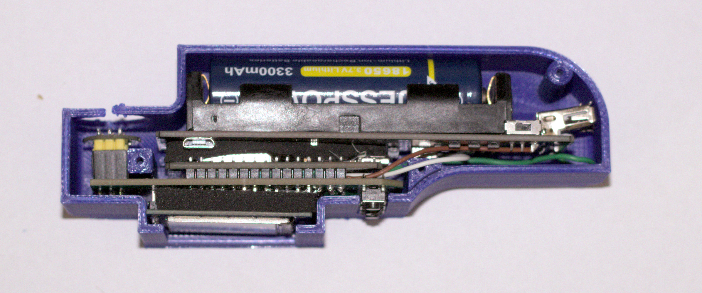
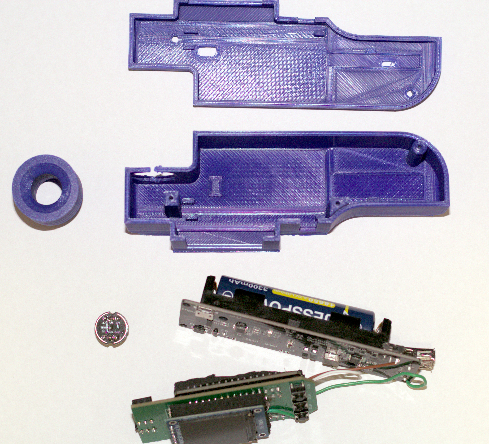
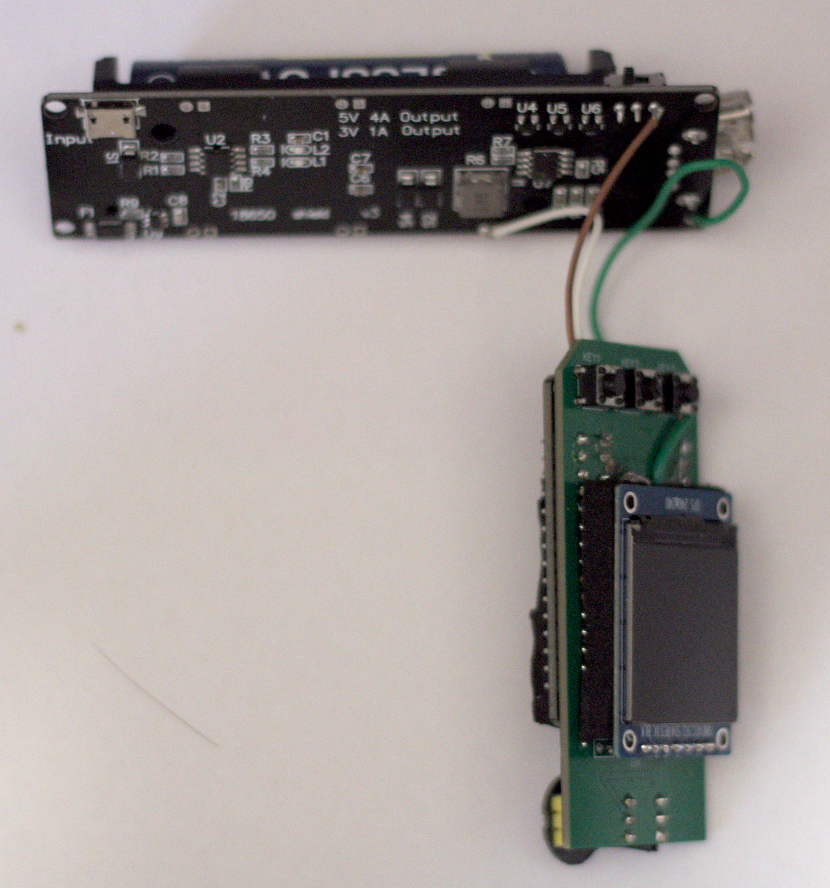
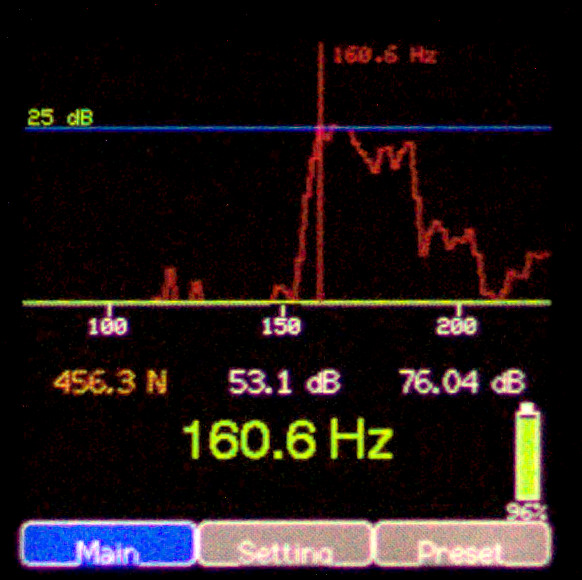
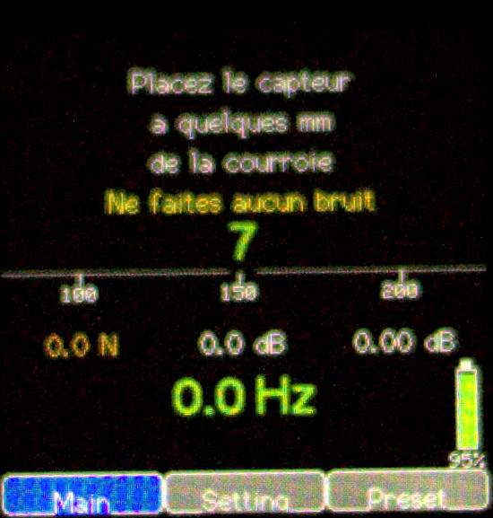
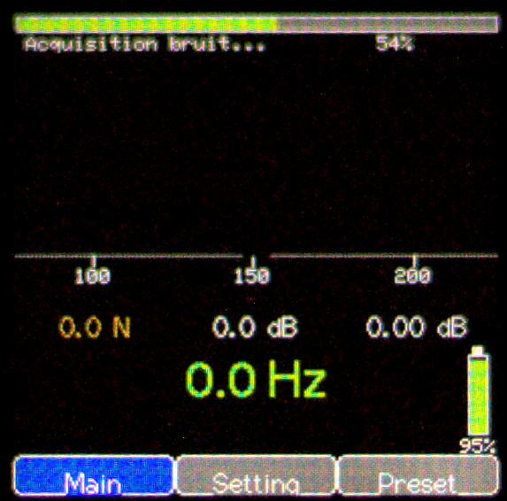
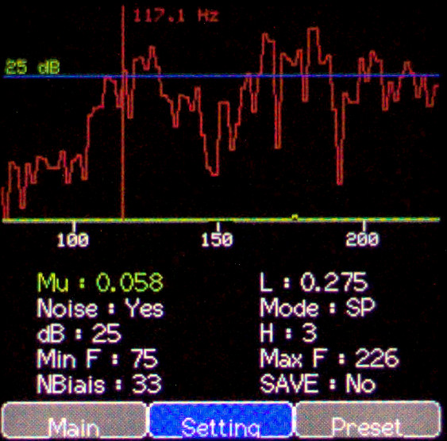
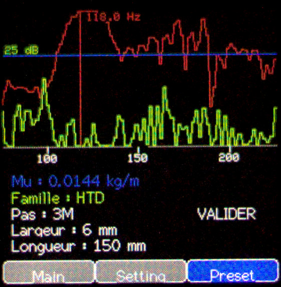

# BeltTuneTool

> Outil portable de mesure de la tension des courroies par analyse fréquentielle, basé sur un ESP32, un microphone et un écran TFT.



---

# Sommaire

- [Présentation](#présentation)
- [Principe de fonctionnement](#principe-de-fonctionnement)
- [Matériel](#matériel)
- [Assemblage](#assemblage)
- [Câblage](#câblage)
- [Boîtier](#boîtier)
- [Compilation](#compilation)
- [Utilisation](#utilisation)
- [Menus](#menus)
- [Réglages](#réglages)
- [Mesure d'une courroie](#mesure-dune-courroie)
- [Fichiers Hardware](#fichiers-hardware)
- [Licence](#licence)

---

# Présentation

**BeltTuneTool** est un appareil portable permettant de mesurer la fréquence propre d'une courroie à l'aide d'un microphone et d'une FFT.

À partir de cette fréquence, il devient possible de régler précisément la tension d'une courroie en utilisant la relation :

\[
T = 4 \times \mu \times L^2 \times f^2
\]

avec :

- **T** : tension de la courroie (N)
- **μ** : masse linéique (kg/m)
- **L** : longueur libre (m)
- **f** : fréquence mesurée (Hz)

L'appareil est particulièrement adapté aux :

- imprimantes 3D
- CNC
- machines-outils
- robots
- transmissions par courroie

---

# Principe de fonctionnement

L'utilisateur pince la courroie.

Le microphone enregistre le son.

Une FFT est calculée par l'ESP32 afin d'identifier la fréquence fondamentale.

La fréquence détectée est ensuite utilisée pour calculer automatiquement la tension de la courroie.

---

# Matériel

Pour réaliser un BeltTuneTool, les composants suivants sont nécessaires.

## Électronique

| Quantité | Désignation |
|----------:|-------------|
| 1 | ESP32 DEV |
| 1 | NMP441 Module de Microphone Omnidirectionnel, Microphone à Interface I2S Sortie MEMS  |
| 1 | Module d'affichage TFT IPS 1,3" 240×240 pixels, contrôleur **ST7789**, interface SPI, alimentation 3,3 V |
| 1 | Support de batterie **AZDelivery 18650** avec chargeur intégré (Micro-USB, sortie 5 V / 3 V) |
| 1 | Accumulateur Li-Ion **18650** |
| 3 | Boutons poussoirs **KEY-TH_4P-L6.0-W6.0-P4.50-LS6.5** |
| 2 | Résistances **100 kΩ** |
| 3 | Condensateurs céramique **100 nF** au format **0805** |
| 2 | Barrettes femelles **HDR-F-2.54**, 15 broches |
| 2 | Barrettes femelles **HDR-F-2.54**, 3 broches |
| 1 | Barrette femelle **HDR-F-2.54**, 8 broches |
| 1 | Mousse auto adhesive a mettre entre les carte |

---

## Circuit imprimé

Le PCB personnalisé est fourni dans le dossier :

```
Hardware/
```

Vous y trouverez :

- le schéma électronique ;
- les fichiers Gerber ;
- les fichiers de perçage.

Il suffit de faire fabriquer le PCB auprès du fabricant de votre choix.

---

## Pièces imprimées en 3D

Les trois pièces du boîtier sont disponibles dans le dossier :

```
3D Models/
```

Les formats suivants sont fournis :

- STL
- STEP
- GCode

Les trois pièces à imprimer sont :

- Face avant
- Corps du boîtier
- Couvercle arrière

Une fois imprimées, elles permettent de monter l'ensemble de l'électronique sans modification.

---

## Ensemble des pièces



Le boîtier est composé de plusieurs éléments imprimés en 3D accueillant :

- la carte ESP32
- le PCB
- l'écran TFT
- les boutons
- le microphone

---

# Câblage

## Connexions



Le câblage est volontairement simple afin de limiter les parasites sur le microphone.

Le schéma électronique complet est disponible dans le dossier :

```
Hardware/
```

---

# Boîtier

Une fois assemblé :


Les fichiers suivants sont fournis :

- STEP
- STL
- GCode

Ils sont disponibles dans :

```
3D Models/
```

---

# Compilation

Le projet est développé sous Arduino IDE.

## Bibliothèques nécessaires

Selon votre installation :

- TFT_eSPI
- arduinoFFT
- Preferences / EEPROM
- SPI
- Wire

Sélectionner une carte ESP32 compatible puis compiler le projet.

---

# Utilisation

Au démarrage, l'écran principal apparaît.

L'utilisateur :

1. choisit un preset ou règle les paramètres
2. pince la courroie
3. attend la détection
4. lit la fréquence
5. lit la tension calculée

---

# Menus

## Écran principal



Cet écran affiche :

- fréquence détectée
- tension calculée
- Score en dB
- ecart type des 3 derniere mesure en dB

C'est l'écran utilisé pendant les mesures.

---

## Début d'acquisition



L'appareil attend que la courroie soit pincée.

Lorsque le niveau sonore dépasse le seuil défini, l'acquisition démarre automatiquement.

---

## Acquisition



Pendant cette phase :

- acquisition audio
- calcul FFT
- recherche du pic principal
- calcul de la fréquence
- calcul de la tension

---

## Menu Settings



Ce menu permet de modifier tous les paramètres de fonctionnement.

---

## Menu Presets



Les presets permettent de mémoriser rapidement plusieurs configurations de courroies.

Par exemple :

- GT2 6 mm
- GT2 9 mm
- HTD
- Courroie CNC
- Configuration personnelle

Le changement de preset recharge instantanément les paramètres associés.

---

# Réglages

## Mu

Masse linéique de la courroie.

Exprimée en kg/m.

Cette valeur est utilisée pour calculer la tension.

Plus elle est précise, plus la tension calculée sera exacte.

Des valeurs prédéfinit dans les pré-set sont définit , néamoins le mieux reste de pesé la courroie et de ramené sont poid au metre

---

## L

Longueur libre de la courroie.

Distance entre les deux points fixes.

Elle intervient directement dans le calcul de la tension.

---

## Noise

Lance une mesure du bruit ambiant.

Le niveau mesuré est utilisé afin d'améliorer la détection de la vibration réelle de la courroie.

Cette fonction est particulièrement utile dans un atelier bruyant.

---

## Mode

Choix du mode d'affichage.

---

## dB

Seuil de déclenchement.

Si le signal est inférieur à cette valeur :

- aucune acquisition

Si le signal dépasse cette valeur :

- lancement automatique de la mesure.

---

## H

Nombre d'harmoniques analysées.

Une valeur plus élevée peut améliorer la robustesse de la détection sur certaines courroies.

---

## Min F

Fréquence minimale recherchée.

Permet d'éviter la détection de parasites basse fréquence.

---

## Max F

Fréquence maximale recherchée.

Limite la recherche de la FFT afin d'accélérer les calculs et réduire les faux positifs.

---

## NBiais

Nombre d'échantillons utilisés pour l'estimation du bruit.

Une valeur élevée améliore généralement la stabilité au prix d'un temps d'initialisation plus long.

---

## SAVE

Sauvegarde tous les paramètres dans la mémoire non volatile.

Ils seront automatiquement restaurés au prochain démarrage.

---

# Mesure d'une courroie

## Préparation

Pour obtenir une mesure fiable, il est indispensable que les paramètres correspondent à la courroie mesurée.

Les deux paramètres les plus importants sont :

- **μ (Mu)** : masse linéique de la courroie (kg/m)
- **L** : longueur libre entre les deux points de fixation (m)

> **Important**
>
> La fréquence mesurée est indépendante de ces paramètres, mais **la tension calculée ne sera correcte que si les valeurs de μ et L sont exactes**.

Si ces valeurs sont erronées, la fréquence affichée restera correcte, mais la tension calculée sera fausse.

---

## Déterminer la masse linéique (μ)

La masse linéique peut être obtenue :

- à partir de la documentation du fabricant ;
- ou en la mesurant directement.

Pour cela :

1. couper un morceau de courroie de longueur connue ;
2. le peser avec une balance précise ;
3. calculer :

```
μ = Masse / Longueur
```

Exemple :

- longueur : 1 m
- masse : 0,038 kg

```
μ = 0,038 kg/m
```

Cette méthode permet souvent d'obtenir une meilleure précision lorsque la documentation constructeur n'est pas disponible.

---

## Réaliser une mesure

1. Charger un preset ou régler les paramètres.
2. Vérifier **μ** et **L**.
3. Effectuer une acquisition de bruit si nécessaire.
4. Placer le microphone à quelques millimètres de la courroie.
5. Pincer la courroie.
6. Attendre la fin de l'acquisition.
7. Lire la fréquence détectée.
8. Lire la tension calculée.

---

# Acquisition du bruit

L'acquisition du bruit permet au BeltTuneTool de mesurer le niveau sonore ambiant afin d'améliorer la détection de la vibration de la courroie.

Pour obtenir un résultat optimal :

- approcher le microphone à seulement quelques millimètres de la courroie ;
- laisser la courroie parfaitement immobile ;
- **éteindre tous les moteurs**, ventilateurs, broches et autres sources de vibrations ;
- éviter toute manipulation pendant l'acquisition.

Plus le bruit de référence est représentatif de l'environnement réel, plus la détection sera robuste.

---

# Comprendre le graphe FFT

Après chaque mesure, le BeltTuneTool analyse le signal sonore grâce à une FFT (Fast Fourier Transform).

Le graphe représente :

- l'axe horizontal : la fréquence (Hz)
- l'axe vertical : l'amplitude du signal

Chaque pic correspond à une composante fréquentielle présente dans la vibration de la courroie.

La fréquence recherchée est la **fréquence fondamentale**, c'est-à-dire la première fréquence de vibration de la courroie.

Les autres pics sont appelés **harmoniques**.

Par exemple :

```
Amplitude

│
│                  ▲ Harmonique 3
│
│          ▲ Harmonique 2
│
│   ▲ Fondamentale
│
└──────────────────────────────────
    50      100      150      Hz
```

Dans un cas idéal, la fondamentale est le pic le plus élevé.

Cependant, selon :

- le matériau de la courroie ;
- sa largeur ;
- sa tension ;
- la position où elle est pincée ;
- la position du microphone ;

certaines harmoniques peuvent devenir plus importantes que la fondamentale.

Le BeltTuneTool utilise donc plusieurs paramètres afin d'identifier automatiquement la bonne fréquence.

---

# Mesures à basse fréquence

La mesure des basses fréquences est plus délicate.

Sous **60 Hz**, même si une calibration spécifique est appliquée, il est fréquent que :

- la fondamentale soit moins énergétique que la deuxième ou troisième harmonique ;
- certaines résonances mécaniques deviennent plus importantes que la vibration principale.

L'algorithme tente de retrouver automatiquement la fondamentale en analysant les relations entre les différents pics, mais cette situation reste physiquement plus difficile.

---

# Limites du capteur

Le microphone MEMS possède naturellement une sensibilité réduite dans les très basses fréquences.

En pratique :

- **au-dessus de 60 Hz** : fonctionnement optimal ;
- **entre 30 et 60 Hz** : les mesures restent possibles mais demandent davantage de précautions ;
- **en dessous de 30 Hz** : les performances du capteur deviennent limitées et la détection peut être moins fiable.

Pour les très faibles fréquences, il est recommandé :

- de placer le microphone très près de la courroie ;
- d'éliminer toute source de vibration parasite ;
- de réaliser plusieurs mesures afin de vérifier leur cohérence.

---

# Conseils pour une mesure fiable

- Utiliser la bonne masse linéique (**μ**).
- Mesurer précisément la longueur libre (**L**).
- Réaliser une acquisition du bruit avant les premières mesures.
- Positionner le microphone à quelques millimètres de la courroie.
- Pincer toujours la courroie de manière similaire.
- Éviter de toucher la machine pendant la mesure.
- Couper les moteurs et les ventilateurs lorsque cela est possible.
- Réaliser plusieurs acquisitions et comparer les résultats.
---

# Fichiers Hardware

Le dossier **Hardware** contient :

- schéma électronique
- PCB
- Gerbers

Le dossier **3D Models** contient :

- fichiers STL
- fichier STEP
- GCode

permettant de reconstruire entièrement l'appareil.

---

# Arborescence

```
BeltTuneTool
│
├── BeltTuneTool/        Code source Arduino
├── Hardware/            PCB + schéma
├── 3D Models/           STL / STEP / GCode
├── img/                 Documentation
└── README.md
```

---

# Licence

Ce projet est distribué sous licence **MIT**.

Voir le fichier `LICENSE`.

---

# Auteur

Développé par **Jérôme Favrou**.

Contributions, améliorations et retours d'expérience sont les bienvenus.
